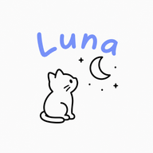
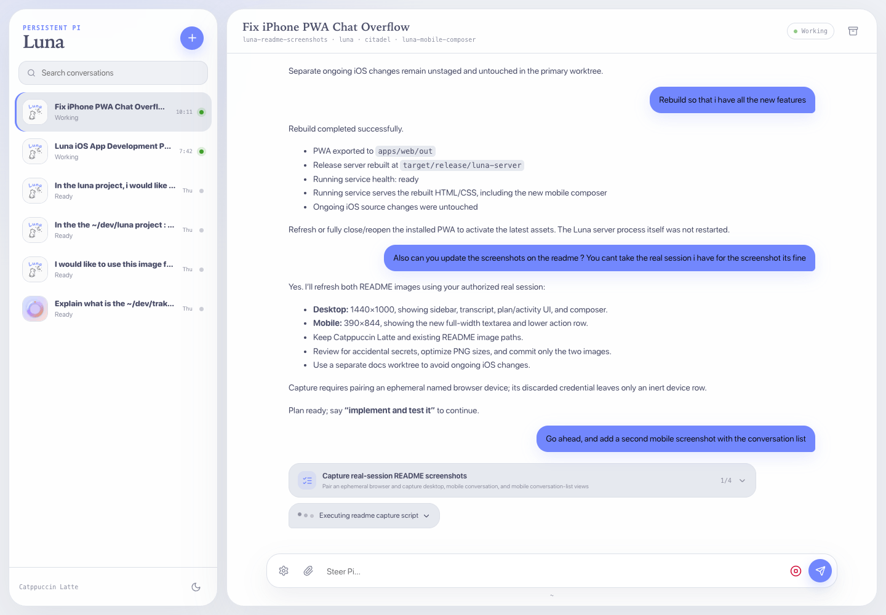
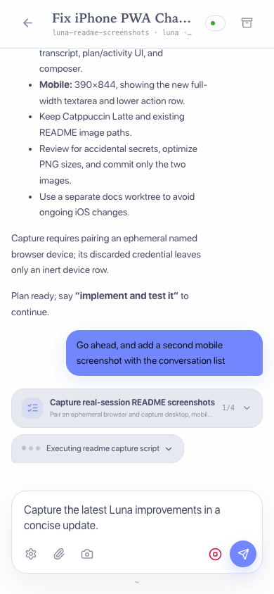
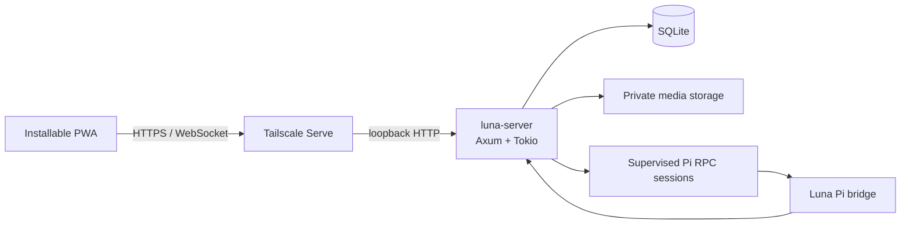

<p align="center">
  
</p>

<h1 align="center">Luna</h1>

<p align="center">
  Persistent Pi conversations from every device.<br>
  A private Rust server and installable PWA for continuing agent work without losing context.
</p>

<p align="center">
  <strong>Rust</strong> · <strong>Axum</strong> · <strong>SQLite</strong> · <strong>Next.js</strong> · <strong>Pi RPC</strong> · <strong>Tailscale</strong>
</p>



<p align="center">
  
</p>

## What Luna does

- Keeps one supervised Pi RPC session per active conversation.
- Streams normalized assistant messages, tool activity, state, workspace, and repository updates.
- Restores durable Pi context after server or process restarts.
- Supports steering, interruption, Markdown, syntax highlighting, image attachments, and voice transcription.
- Tracks multiple repositories and discovers project icons automatically.
- Syncs reconnecting devices through retained, cursor-based events.
- Installs as a responsive, offline-capable PWA with Catppuccin Latte and Mocha themes.
- Serves everything from one loopback-bound Rust process.

Raw terminal output never reaches clients. SQLite is authoritative for client state, while Pi's session JSONL remains authoritative for agent context.

## Architecture



The server owns authentication, normalized event persistence, session supervision, dispatch reconciliation, retention, and recovery. Citadel supervises only the Luna server process; Luna supervises its own Pi children.

## Repository layout

| Path                     | Purpose                                                         |
| ------------------------ | --------------------------------------------------------------- |
| `crates/luna-server`     | Axum HTTP/WebSocket server and Pi orchestration                 |
| `crates/luna-storage`    | SQLx/SQLite persistence and migrations                          |
| `crates/luna-pi`         | Strict JSONL RPC client, process supervision, and normalization |
| `crates/luna-protocol`   | Canonical Serde/Schemars/Utoipa protocol types                  |
| `apps/web`               | Statically exported Next.js PWA                                 |
| `integrations/pi`        | Pi bridge extension                                             |
| `integrations/citadel`   | Production service manifest                                     |
| `packages/protocol`      | Generated OpenAPI and TypeScript bindings                       |
| `packages/design-tokens` | Shared Catppuccin design tokens                                 |

## Development

Requirements: Rust 1.95+, Node.js 24+, and pnpm 11.3+.

```sh
pnpm install
pnpm generate
pnpm test
pnpm typecheck
pnpm lint
pnpm build
```

Run the complete application locally:

```sh
pnpm build:web
LUNA_ENV_FILE=/tmp/luna-development.env cargo run -p luna-server
```

On the pairing screen, choose **Ask for a pairing code**. Luna writes a fresh single-use, 15-minute code to its Citadel stdout log and invalidates older unused codes. Enter that newest code with a device name; the web client exchanges it for a credential stored in an HttpOnly, SameSite cookie.

Run deterministic browser acceptance coverage with locally installed Chrome:

```sh
pnpm --filter @luna/web test:e2e
```

The suite covers pairing, persistent streaming, steering, interruption, image upload, rename/archive flows, reload recovery, themes, service workers, keyboard behavior, and serious/critical accessibility checks.

## Production

Luna is designed to bind only to `127.0.0.1`, run under [Citadel](https://github.com/YannickHerrero/citadel), and be exposed privately through **Tailscale Serve**—never Funnel.

Production configuration lives outside Git in `~/.config/luna/server.env` with mode `600`. State defaults to `~/Library/Application Support/Luna Server` and includes SQLite, Pi sessions, attachments, and repository icons.

See [`docs/deployment.md`](docs/deployment.md) for build, backup, Citadel, Tailscale, verification, and rollback procedures.

## Security and privacy

- Loopback binding by default
- Tailnet identity allowlisting
- One-time pairing codes and hashed device credentials
- Origin validation and strict device cookies
- Authenticated private attachment and icon routes
- Bounded request, image decode, and event-retention limits
- Ephemeral transcription proxying without audio persistence
- Security headers, immutable hashed assets, and no-cache app entry points
- No Funnel configuration or raw terminal transport

## Current scope

Luna V1 provides the complete server and PWA stack. Native iOS/iPadOS clients and notification delivery are intentionally deferred; notification-target tracking is already preserved in the protocol and storage model.
