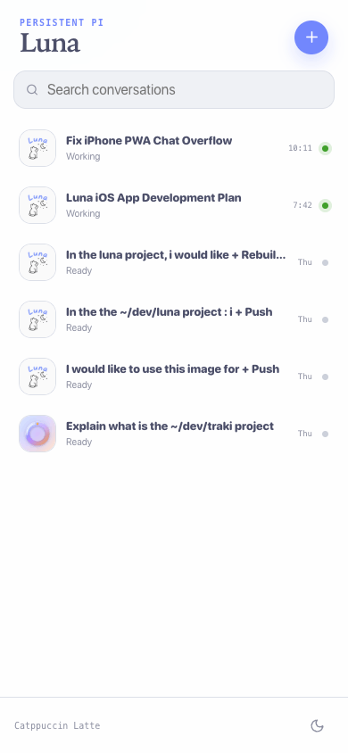
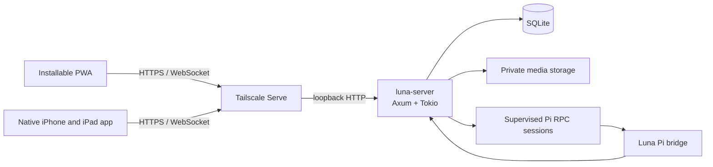

<p align="center">
  
</p>

<h1 align="center">Luna</h1>

<p align="center">
  Persistent Pi conversations from every device.<br>
  A private Rust server with web, iPhone, and iPad clients for continuing agent work without losing context.
</p>

<p align="center">
  <strong>Rust</strong> · <strong>Axum</strong> · <strong>SQLite</strong> · <strong>Next.js</strong> · <strong>SwiftUI</strong> · <strong>Pi RPC</strong> · <strong>Tailscale</strong>
</p>


<p align="center">
  
  
</p>

## What Luna does

- Keeps one supervised Pi RPC session per active conversation.
- Streams normalized assistant messages, tool activity, state, workspace, and repository updates.
- Restores durable Pi context after server or process restarts.
- Supports steering, interruption, explicit `!` shell commands, Markdown, syntax highlighting, image attachments, and voice transcription.
- Generates concise contextual conversation titles with an isolated Pi model request.
- Tracks multiple repositories and discovers project icons automatically.
- Syncs reconnecting devices through retained, cursor-based events.
- Runs as a responsive, offline-capable PWA and a universal native iPhone/iPad app with Catppuccin Latte and Mocha themes.
- Ships reserved iOS/watchOS widget surfaces and an embedded Apple Watch companion placeholder for staged native expansion.
- Serves everything from one loopback-bound Rust process.

Pi process stdout never reaches clients. Output from an authenticated user's explicit `!` shell command is the sole exception: Luna bounds and persists it as a conversation message. SQLite is authoritative for client state, while Pi's session JSONL remains authoritative for agent context.

## Architecture



The server owns authentication, normalized event persistence, session supervision, dispatch reconciliation, retention, and recovery. Citadel supervises only the Luna server process; Luna supervises its own Pi children.

## Repository layout

| Path                     | Purpose                                                         |
| ------------------------ | --------------------------------------------------------------- |
| `crates/luna-server`     | Axum HTTP/WebSocket server and Pi orchestration                 |
| `crates/luna-storage`    | SQLx/SQLite persistence and migrations                          |
| `crates/luna-pi`         | Strict JSONL RPC client, process supervision, and normalization |
| `crates/luna-protocol`   | Canonical Serde/Schemars/Utoipa protocol types                  |
| `apps/web`               | Statically exported Next.js PWA                                 |
| `apps/ios`               | iPhone/iPad app, widgets, Watch companion, tests, and XcodeGen  |
| `integrations/pi`        | Pi bridge extension                                             |
| `integrations/citadel`   | Production service manifest                                     |
| `fastlane`               | Apple ID bootstrap, signing, archive, and TestFlight upload     |
| `packages/protocol`      | Generated OpenAPI and TypeScript bindings                       |
| `packages/design-tokens` | Shared Catppuccin design tokens                                 |

## Development

Requirements: Rust 1.95+, Node.js 24+, and pnpm 11.3+. Native Apple development additionally requires Xcode with iOS 18+ and watchOS 11+ SDKs plus XcodeGen 2.45+.

```sh
pnpm install
pnpm generate
pnpm test
pnpm typecheck
pnpm lint
pnpm build
```

Run the complete application locally:

```sh
pnpm build:web
LUNA_ENV_FILE=/tmp/luna-development.env cargo run -p luna-server
```

On the pairing screen, choose **Ask for a pairing code**. Luna writes a fresh six-digit, single-use, 15-minute code to its Citadel stdout log and invalidates older unused codes. Enter that newest code with a device name; the web client exchanges it for a credential stored in an HttpOnly, SameSite cookie.

Run deterministic browser acceptance coverage with locally installed Chrome:

```sh
pnpm --filter @luna/web test:e2e
```

The suite covers pairing, persistent streaming, steering, interruption, image upload, rename/archive flows, reload recovery, themes, service workers, keyboard behavior, and serious/critical accessibility checks.

### Native iPhone and iPad development

The checked-in Xcode project is generated from `apps/ios/project.yml`. After running `pnpm generate`, regenerate it with XcodeGen and run the native unit/UI suite on an available simulator:

```sh
cd apps/ios
xcodegen generate
cd ../..
xcrun simctl list devices available
xcodebuild test \
  -project apps/ios/Luna.xcodeproj \
  -scheme Luna \
  -destination 'platform=iOS Simulator,id=<SIMULATOR_UDID>'
```

The native pairing screen can select a private HTTPS server, while `LUNA_SERVER_URL` provides a temporary Xcode-scheme override for development. Device credentials remain in Keychain. See [`apps/ios/README.md`](apps/ios/README.md) for setup, architecture, fixture arguments, iPad/watchOS verification, signing, widgets, and notification-readiness details. TestFlight automation lives in [`fastlane`](fastlane/README.md).

## Production

Luna is designed to bind only to `127.0.0.1`, run under [Citadel](https://github.com/YannickHerrero/citadel), and be exposed privately through **Tailscale Serve**—never Funnel.

Production configuration lives outside Git in `~/.config/luna/server.env` with mode `600`. State defaults to `~/Library/Application Support/Luna Server` and includes SQLite, Pi sessions, attachments, and repository icons.

See [`docs/deployment.md`](docs/deployment.md) for build, backup, Citadel, Tailscale, verification, and rollback procedures.

## Security and privacy

- Loopback binding by default
- Tailnet identity allowlisting
- One-time pairing codes and hashed device credentials
- Origin validation and strict device cookies
- Authenticated private attachment and icon routes
- Bounded request, image decode, and event-retention limits
- Ephemeral transcription proxying without audio persistence
- Sanitized account-level weekly usage without copying Codex credentials to clients
- Security headers, immutable hashed assets, and no-cache app entry points
- No Funnel configuration or raw terminal transport

## Current scope

Luna V1 provides the complete server, PWA, and universal native iPhone/iPad client. The first Apple archive also reserves an iOS widget, an embedded Watch companion, and Watch accessory widgets with explicit placeholder copy. APNs registration and provider delivery are intentionally deferred; Push capability, device targeting, and stable conversation deep links are already preserved for that work.
